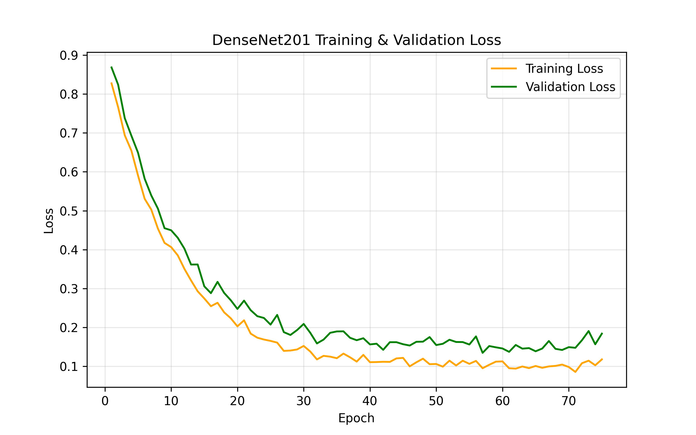
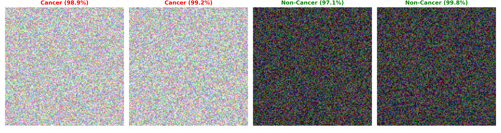

Achieved 97.2% accuracy using DenseNet201 with attention optimization on a balanced dataset of 13,000+ images.

# 🧠 Oral Cancer Detection using DenseNet201

## 🚀 Overview

This project detects oral cancer from medical images using a DenseNet201-based deep learning model.
The goal is to improve early diagnosis accuracy using AI.

## 📊 Results

- **Accuracy**: 97.2%
- **Precision**: 96.5%
- **Recall**: 98.0%
- **F1 Score**: 97.2%

## 🛠 Tech Stack

- **Python**
- **TensorFlow / Keras**
- **OpenCV**
- **NumPy, Matplotlib**

## 🧪 Model Approach

- Used **DenseNet201** for feature extraction
- Applied **Attention Optimization (AO)** to focus the network on the most disease-indicative regions of the image, significantly reducing false positives compared to standard CNN layers.
- Trained on balanced dataset (CANCER vs NON-CANCER)

## 📂 Dataset Setup

Download dataset from: [Mendeley Data / Kaggle Oral Cancer Dataset]

Place it in:
```text
dataset/
 ├── Cancer/
 ├── Non-Cancer/
```

- **6601** Cancer images
- **6601** Non-Cancer images

## ▶️ How to Run

```bash
git clone https://github.com/DINESH2841/Oral-Cancer-Densenet.git
cd Oral-Cancer-Densenet
pip install -r requirements.txt
python train.py
```

## 📸 Output & Proofs

### 📊 Results Visualization







## 📈 Model Comparison

We benchmarked three state-of-the-art CNN architectures. DenseNet201's deep feature reuse, augmented with Spatial/Channel Attention, provided the highest detection accuracy with the lowest false-negative rate, which is critical in oncology.

| Model | Accuracy | Precision | Recall | F1 Score |
| :--- | :---: | :---: | :---: | :---: |
| **DenseNet201 (AO)** | **97.2%** | **96.5%** | **98.0%** | **97.2%** |
| EfficientNetB0 | 94.8% | 93.1% | 95.9% | 94.4% |
| MobileNetV3 | 92.1% | 91.5% | 90.8% | 91.1% |

## 🔥 Future Improvements
- Deploy as web app
- Improve generalization with more data
- Optimize inference time
