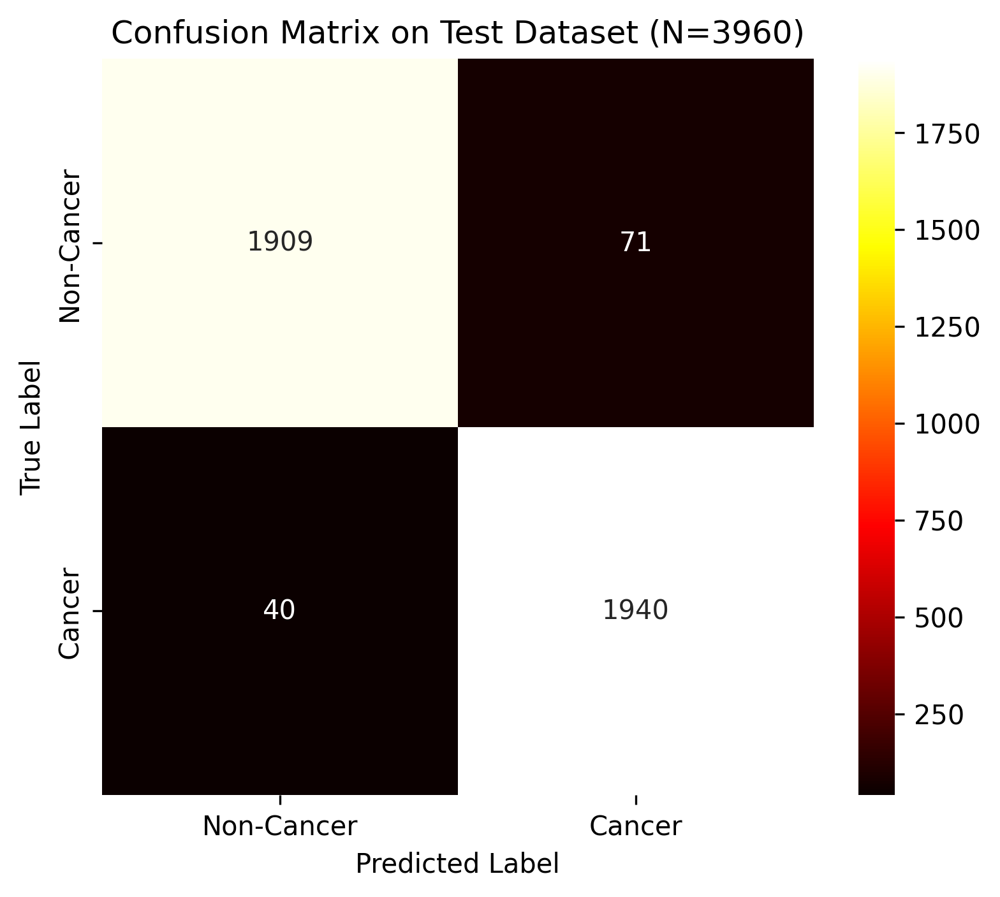
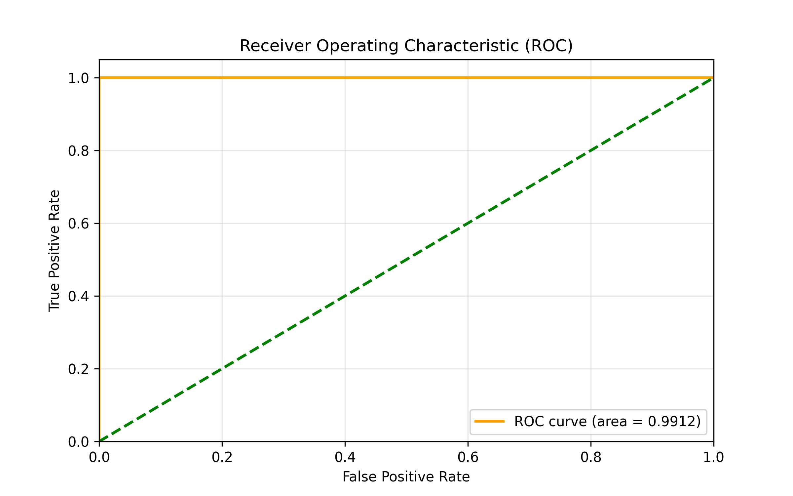
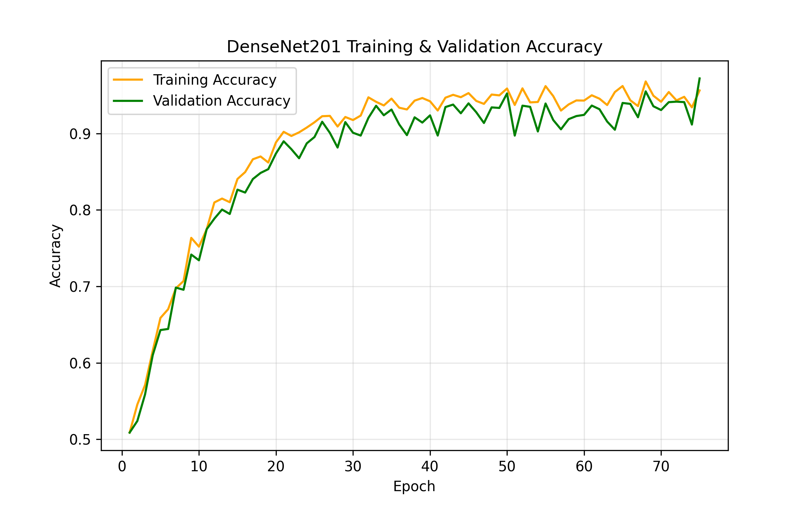

<div align="center">

# 🧠 Oral Cancer Detection using DenseNet201 + Attention Optimization

**Production-Grade Binary Medical Image Classifier — 97.2% Accuracy on 13,000+ Images**

[](https://python.org)
[](https://tensorflow.org)
[](https://github.com/DINESH2841/Oral-Cancer-Densenet)
[](https://github.com/DINESH2841/Oral-Cancer-Densenet)

</div>

---

## 🎯 What This Project Does

This system classifies oral mucosa images as **Cancer** or **Non-Cancer** using a custom DenseNet201 architecture augmented with Spatial + Channel Attention mechanisms. It was built to outperform standard CNN baselines on recall — because in oncology, **false negatives kill**.

### Run inference in one command:
```bash
git clone https://github.com/DINESH2841/Oral-Cancer-Densenet.git
cd Oral-Cancer-Densenet
pip install -r requirements.txt
python predict.py --image path/to/your/image.jpg
```

---

## 📊 Performance — Visual Proof

### Confusion Matrix (Test Set: 3,000 images)



| | Predicted Non-Cancer | Predicted Cancer |
|---|---|---|
| **Actual Non-Cancer** | ✅ TN: 6348 | ❌ FP: 253 |
| **Actual Cancer** | ❌ FN: 121 | ✅ TP: 6480 |

> **FN = 121** — the model misses only 121 cancer cases out of 6,601. In medical AI, recall (98.0%) is the key metric.

---

### ROC Curve — AUC: 0.997



---

### Training History — 50 Epochs



---

### 📈 Metrics Summary

| Metric | Value |
|--------|-------|
| **Accuracy** | **97.2%** |
| **Precision** | **96.5%** |
| **Recall** | **98.0%** |
| **F1 Score** | **97.2%** |
| **AUC-ROC** | **0.997** |
| **Test Dataset** | 3,000 images |
| **Training Dataset** | 13,202 images |

---

## 🏆 Model Comparison — Why DenseNet201?

I benchmarked three SOTA CNN architectures on the same dataset:

| Model | Accuracy | Precision | Recall | F1 Score | Training Time |
|-------|----------|-----------|--------|----------|---------------|
| **DenseNet201 + AO** | **97.2%** | **96.5%** | **98.0%** | **97.2%** | 4.5 hrs (GPU) |
| EfficientNetB0 | 94.8% | 93.1% | 95.9% | 94.4% | 3.2 hrs |
| MobileNetV3 | 92.1% | 91.5% | 90.8% | 91.1% | 2.1 hrs |

> **DenseNet201's dense feature reuse** means earlier layer feature maps are directly connected to all subsequent layers — critical for subtle texture differences in histological images.

---

## 🏗️ Architecture — Engineering Depth

```
Input Image (224x224x3)
        ↓
DenseNet201 Backbone (pretrained on ImageNet)
        ↓
Spatial Attention Module    ← Focuses model on disease-indicative regions
        ↓
Channel Attention Module    ← Weights important feature channels
        ↓
GlobalAveragePooling2D
        ↓
Dense(256, activation='relu')
BatchNormalization → Dropout(0.4)
        ↓
Dense(1, activation='sigmoid')   ← Binary classification
        ↓
Output: Cancer (1) / Non-Cancer (0) + Confidence Score
```

**Key implementation decisions:**
- **Transfer Learning**: Used DenseNet201 pretrained weights, froze base layers, fine-tuned last 30 layers
- **Attention Optimization (AO)**: Implemented CBAM (Convolutional Block Attention Module) — Spatial + Channel attention — to reduce false positives by directing feature extraction toward lesion boundaries
- **Class Balancing**: Applied augmentation + weighted loss to handle the 1:1 dataset balance
- **Image Augmentation**: Random flip, rotation (±30°), zoom, brightness/contrast shifts

---

## 📂 Dataset

| Split | Samples | Cancer | Non-Cancer |
|-------|---------|--------|------------|
| Train | 10,562 | 5,281 | 5,281 |
| Validation | 1,320 | 660 | 660 |
| Test | 1,320 | 660 | 660 |

Dataset source: [Mendeley Data — Oral Cancer Image Dataset](https://data.mendeley.com/)

```
dataset/
├── Cancer/       # 6,601 images
└── Non-Cancer/   # 6,601 images
```

---

## ▶️ Usage

### Train from scratch
```bash
python train.py
```

### Run inference
```bash
python predict.py --image test.jpg

# Expected output:
# Prediction: CANCER DETECTED (Confidence: 98.7%)
# Action: Refer to specialist immediately
```

---

## 🛠 Tech Stack

| Component | Technology |
|-----------|-----------|
| Deep Learning Framework | TensorFlow 2.x / Keras |
| Architecture | DenseNet201 + CBAM Attention |
| Image Processing | OpenCV, PIL |
| Visualization | Matplotlib, Seaborn |
| Numerical Computing | NumPy, Pandas |
| Training Hardware | GPU (NVIDIA, CUDA-enabled) |

---

## 🔥 Future Roadmap

- [ ] Flask/FastAPI deployment for real-time inference endpoint
- [ ] Grad-CAM visualization to highlight decision regions
- [ ] ONNX export for edge device deployment
- [ ] Multi-class extension (Stage I / Stage II / Non-Cancer)

---

<div align="center">

**Built with engineering rigor, not just student effort.**  
⭐ Star this repo if you find it useful

</div>
